# Real Estate CRM - System Architecture

## Overview
Comprehensive Real Estate Customer Relationship Management (CRM) system with AI integration, designed to provide complete business management capabilities for real estate professionals through intelligent automation and workflow optimization.

## Strategic Architecture

### Core System Components
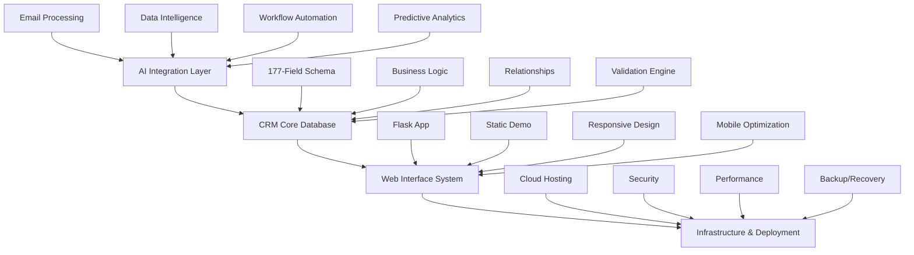

## Data Architecture

### Database Schema (177 Fields)
The system uses a comprehensive database schema designed specifically for real estate transactions:

#### Core Entity Relationships
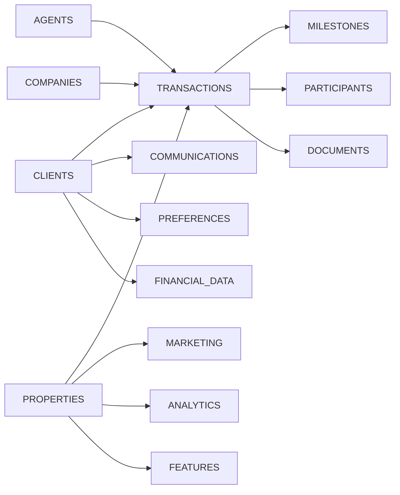

#### Entity Details
- **Clients**: 45+ fields covering personal, financial, and preference data
- **Properties**: 35+ fields for listing management and marketing
- **Transactions**: 40+ fields for complete deal flow tracking
- **Agents**: 25+ fields for team and performance management
- **Companies**: 20+ fields for vendor and partner relationships
- **Communications**: Activity tracking and interaction history

### Data Flow Architecture
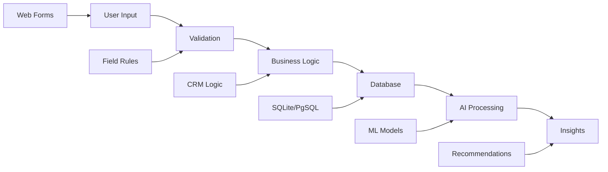

## Application Architecture

### Dual Interface Strategy

#### 1. Flask Web Application (Primary)
```
app/
├── models/              # Database models and business logic
│   ├── client.py       # Client entity management
│   ├── property.py     # Property entity management
│   ├── transaction.py  # Transaction entity management
│   └── relationships.py # Entity relationship management
├── views/              # Route handlers and API endpoints
│   ├── dashboard.py    # Main dashboard routes
│   ├── clients.py      # Client management routes
│   ├── properties.py   # Property management routes
│   └── transactions.py # Transaction management routes
├── templates/          # HTML templates with Jinja2
│   ├── base.html       # Base template with navigation
│   ├── dashboard.html  # Main dashboard interface
│   └── [entity]/       # Entity-specific templates
├── static/             # CSS, JavaScript, and images
│   ├── css/           # Styling and responsive design
│   ├── js/            # Interactive functionality
│   └── img/           # Images and icons
└── config/            # Configuration and settings
    ├── database.py    # Database configuration
    ├── security.py    # Security settings
    └── deployment.py  # Production deployment config
```

#### 2. Static HTML Demo (Secondary)
```
CRM_Demo/
├── index.html          # Main application interface
├── css/
│   ├── bootstrap.min.css
│   └── crm-demo.css   # Custom styling
├── js/
│   ├── jquery.min.js
│   ├── bootstrap.min.js
│   └── crm-demo.js    # Complete CRM functionality
└── data/
    └── sample-data.json # Demo data for localStorage
```

## AI Integration Architecture

### Processing Pipeline
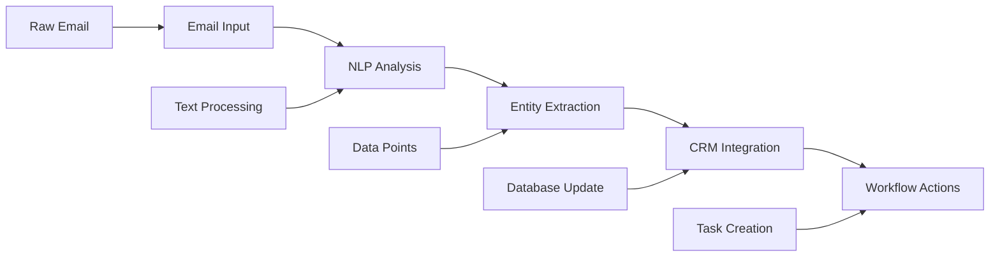

### AI Components
1. **Email Processing Engine**
   - Natural language understanding
   - Entity recognition and extraction
   - Context analysis and categorization

2. **Data Intelligence Layer**
   - Automatic field population
   - Data validation and correction
   - Duplicate detection and merging

3. **Workflow Automation**
   - Task generation and scheduling
   - Priority optimization
   - Deadline management

4. **Predictive Analytics**
   - Client behavior analysis
   - Transaction success prediction
   - Market trend analysis

## Security Architecture

### Multi-Layer Security Model
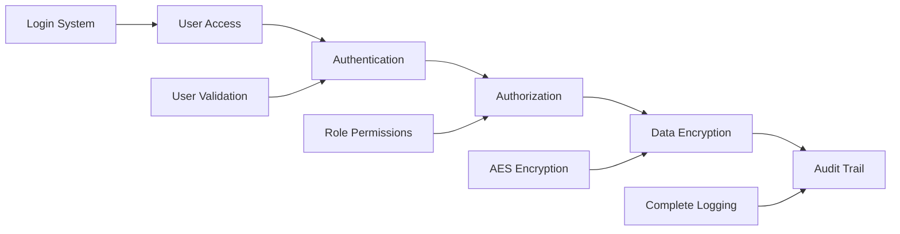

### Security Components
- **Authentication**: Secure login with password hashing
- **Authorization**: Role-based access control (RBAC)
- **Data Protection**: Encryption at rest and in transit
- **Audit Logging**: Complete operation tracking
- **Input Validation**: SQL injection and XSS prevention

## Deployment Architecture

### Cloud Infrastructure
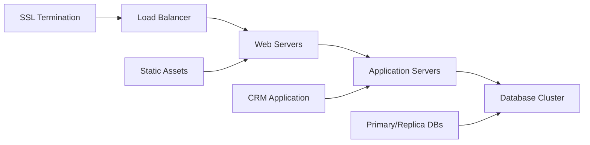

### Infrastructure Components
- **Hosting Platform**: Cloud PaaS (Heroku, Google App Engine, Railway)
- **Database**: PostgreSQL with automated backups
- **Caching**: Redis for session and data caching
- **CDN**: Content delivery for static assets
- **Monitoring**: Application performance monitoring (APM)

## Performance Architecture

### Optimization Strategies
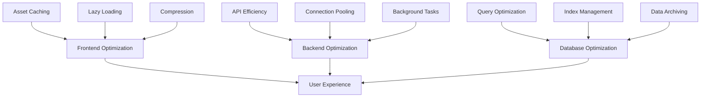

### Performance Targets
- **Page Load Time**: < 3 seconds (target: 1 second)
- **API Response**: < 500ms average
- **Database Queries**: < 100ms average
- **Concurrent Users**: 100+ simultaneous users

## Integration Architecture

### External System Integration
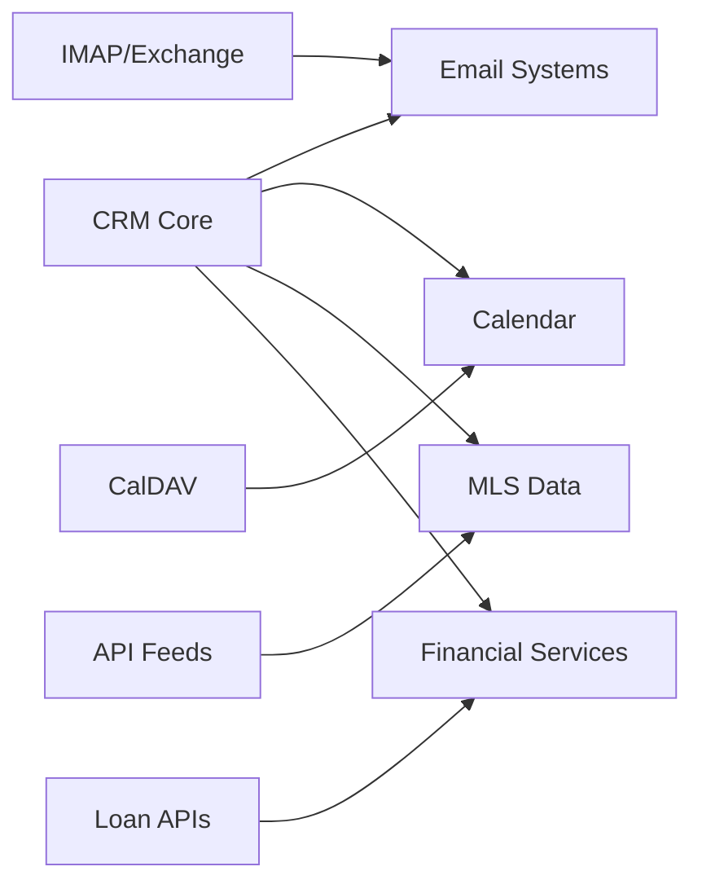

### Integration Points
- **Email Platforms**: Gmail, Outlook, Exchange
- **Calendar Systems**: Google Calendar, Outlook Calendar
- **Real Estate Data**: MLS feeds, property databases
- **Financial Services**: Loan processors, credit reporting
- **Communication**: SMS, VoIP, video conferencing

## Development Architecture

### Development Workflow
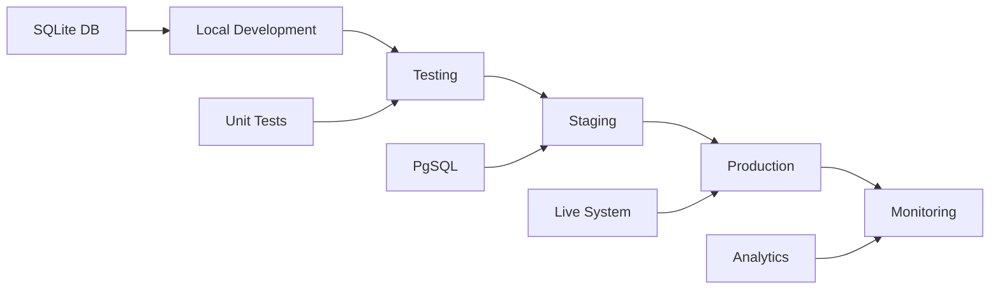

### Development Environment
- **Local**: SQLite database for development
- **Testing**: Comprehensive test suite with CI/CD
- **Staging**: Production-like environment for testing
- **Production**: Live system with monitoring and analytics

## Research Track: PDF Processing

### Background Processing Architecture
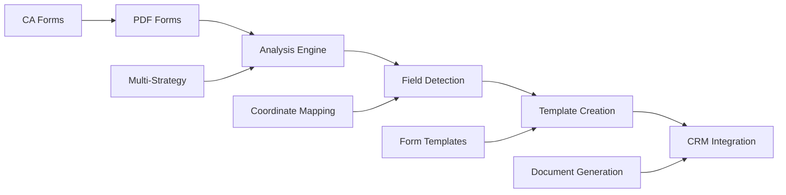

### PDF Processing Components (Research)
- **Form Analysis**: 31 Python modules for PDF processing
- **Template Management**: 13 California disclosure forms
- **Processing Strategies**: Multiple approaches for form completion
- **Legal Compliance**: Regulatory requirement validation

## Current Implementation Status

### Production Ready Components ✅
- **CRM Database**: 177-field comprehensive schema
- **Flask Application**: Full-featured web interface (`real_estate_crm.py`)
- **Static Demo**: Portable HTML demo with localStorage
- **Core Functionality**: Complete CRUD operations for all entities
- **Responsive Design**: Mobile-optimized Bootstrap interface

### Development Priorities
1. **CRM Optimization**: Testing, performance, user experience
2. **AI Integration**: Email processing, workflow automation
3. **Production Deployment**: Hosting, security, monitoring
4. **Research Track**: PDF processing legal compliance

## Scalability Architecture

### Horizontal Scaling Strategy
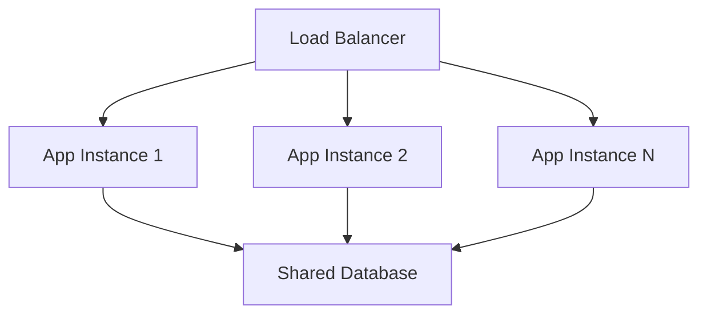

### Scalability Components
- **Stateless Application**: No server-side session storage
- **Database Clustering**: Master/replica configuration
- **Caching Layer**: Distributed caching with Redis
- **CDN Integration**: Global content distribution
- **Microservices**: Modular component architecture

## Success Metrics Architecture

### Monitoring and Analytics
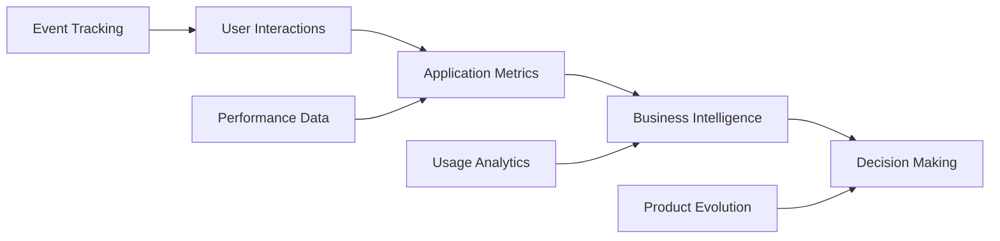

### Key Performance Indicators
- **Technical**: Response time, uptime, error rates
- **Business**: User adoption, feature usage, transaction completion
- **User Experience**: Session duration, task completion, satisfaction

## Future Architecture Considerations

### Planned Enhancements
- **Mobile Application**: Native iOS/Android apps
- **Advanced AI**: Machine learning model improvements
- **Enterprise Features**: Multi-tenant architecture
- **Integration Expansion**: Additional third-party services
- **Global Deployment**: Multi-region hosting strategy

This architecture provides a solid foundation for a comprehensive real estate CRM system while maintaining flexibility for future enhancements and scaling requirements. The evolution from PDF form automation to CRM demonstrates the system's adaptability and growth potential.